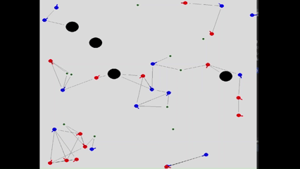
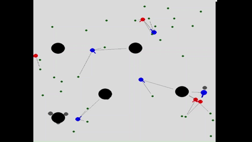

# 🧠 Reinforcement Learning Project  

This project, developed for the Reinforcement Learning exam, explores **multi-agent survival dynamics**.  
Two groups of agents must **hunt the other to survive**, comparing the effectiveness of **Proximal Policy Optimization (PPO)** versus a **Genetic Algorithm (GA)** for evolving the agents’ neural networks.  

---

## 🎮 Simulation Rules  

Each agent can:  
- 👀 **See** the 3 closest objects in its field of view ∊ [-90°, 90°]  
- 🏃 **Decide linear speed** ∊ [-100, 100]  
- 🔄 **Decide angular speed** ∊ [-10, 10]  
- 🍽️ **Eat** smaller enemies and food  

Environment setup:  
- At every new epoch, **food, obstacles, and agents** are randomly placed.  

---

## 🏆 Rewards  

- ➕ **+1** → eating food  
- ➕ **+2** → eating an enemy  
- ➖ **-1** → colliding with obstacles or getting eaten  

---

## 🧩 Agent Perception  

For the 3 closest objects, each agent perceives:  
- 🎯 **Pointing error** ∊ [-0.5, 0.5]  
- 📏 **Distance** ∊ [0, 1]  
- ⚖️ **Size** ∊ {-1, 1}  
- 👫 **Team ID**  

---

## 🧪 Training Results with Genetic Algorithm

Before training, the agents’ neural networks have no understanding of signals. They move almost randomly, often colliding with obstacles or changing direction aimlessly:  

  

After training, most agents learn to **avoid obstacles** and **pursue smaller prey** effectively:  

  

---

